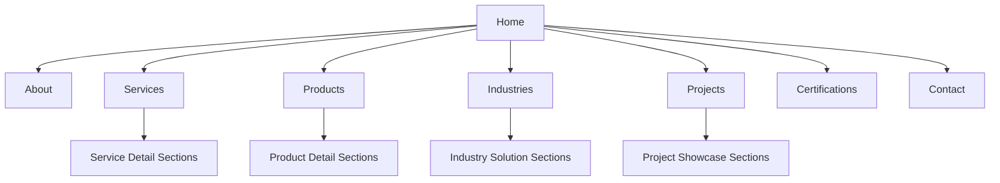
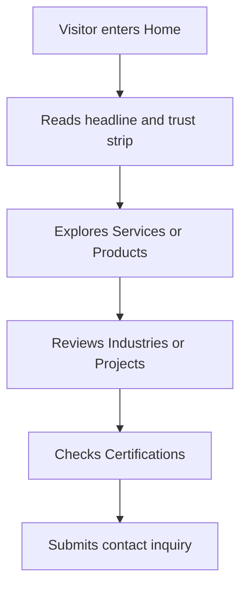
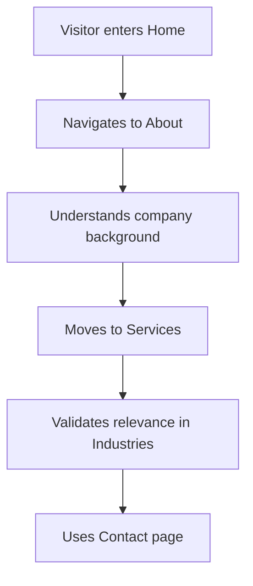
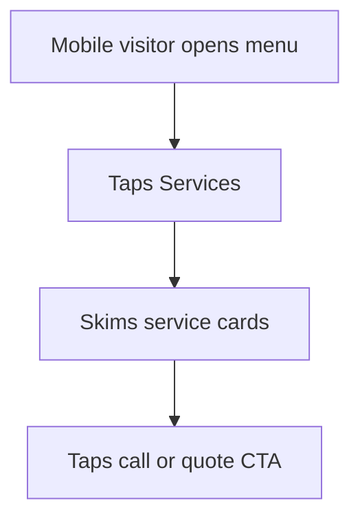

## 1. Phase 2 Scope
This document moves the project into Phase 2 using clearly labeled dummy content for `GSB INFRASTRUCTURE`.

- Purpose: unblock planning and UI architecture before real business content arrives
- Constraint: all service names, product names, certification labels, and project summaries below are provisional placeholders
- Replacement rule: dummy data must be swapped with final client-approved content before production launch

## 2. Dummy Business Positioning
### 2.1 Provisional Positioning Statement
`GSB Infrastructure` is presented as a regional infrastructure and industrial solutions company delivering engineering support, water handling systems, civil execution, and facility-focused project services.

### 2.2 Dummy Value Proposition
- End-to-end infrastructure support
- Reliable project execution
- Industry-ready systems and components
- Safety, quality, and compliance focus
- Responsive post-project support

## 3. Dummy Content Model
### 3.1 Dummy Service Categories
1. **Water Distribution Infrastructure**
   - Pipeline installation
   - Pumping station support
   - Network upgrades
2. **Industrial Utility Systems**
   - Process piping
   - Tank installation
   - Utility line execution
3. **Civil and Structural Works**
   - Equipment foundations
   - Service platforms
   - Drainage and support works
4. **Operation and Maintenance Support**
   - Preventive inspections
   - System troubleshooting
   - Retrofit and repair work

### 3.2 Dummy Product Categories
1. **Pressure Booster Skids**
2. **Storage and Process Tanks**
3. **Filtration and Utility Modules**
4. **Control Panels and Pump Assemblies**

### 3.3 Dummy Industries Served
1. Manufacturing
2. Commercial Facilities
3. Hospitality and Institutions
4. Residential Developments
5. Public Infrastructure

### 3.4 Dummy Certifications and Trust Signals
- ISO 9001 placeholder
- Safety compliance placeholder
- On-time project delivery metric placeholder
- Regional service coverage placeholder

### 3.5 Dummy Projects
1. Utility upgrade for a manufacturing campus in Kozhikode
2. Pumping and tank support system for a commercial building
3. Civil and drainage works for an institutional facility
4. Retrofit of utility infrastructure for a mixed-use property

## 4. Recommended Sitemap

## 5. Navigation Architecture
### 5.1 Primary Navigation
- Home
- About
- Services
- Products
- Industries
- Projects
- Certifications
- Contact

### 5.2 Secondary Navigation
- Process
- Why Choose Us
- Sustainability

### 5.3 Footer Navigation
- Quick links to core pages
- Contact details
- Address
- Email and phone
- Social links placeholder

## 6. Homepage Information Architecture
1. **Hero**
   - Heading: infrastructure-led positioning
   - Supporting copy: expertise, trust, speed, and regional service availability
   - CTAs: `Request a Quote` and `View Services`
2. **Trust Strip**
   - Dummy metrics
   - Certification badges
   - Service coverage statement
3. **Company Introduction**
   - Short overview of company capability and execution style
4. **Core Services**
   - Four service cards linked to the Services page
5. **Industries Served**
   - Industry cards with short needs-based descriptions
6. **Why Choose Us**
   - Reliability, compliance, engineering quality, support
7. **Process**
   - Inquiry, assessment, proposal, execution, delivery, support
8. **Featured Products**
   - Four product cards with application labels
9. **Projects**
   - Three to four highlighted case-study cards
10. **Certifications**
   - Dummy compliance and quality indicators
11. **CTA Banner**
   - Request consultation or quotation
12. **Contact Section**
   - Phone, email, address, and inquiry form
13. **Footer**
   - Contact details, quick links, and business statement

## 7. Page-Level Information Architecture
### 7.1 About
- Company overview
- Mission and vision placeholders
- Values
- Work methodology
- Why clients choose the company

### 7.2 Services
- Intro section
- Service category overview
- Service detail blocks
- Process support section
- CTA

### 7.3 Products
- Intro section
- Product category cards
- Product detail teasers
- Application mapping
- CTA

### 7.4 Industries
- Industry overview
- Industry-specific challenges
- Matching service and product solutions
- Proof section

### 7.5 Projects
- Featured projects grid
- Project highlights
- Sector tags
- Outcome summaries

### 7.6 Certifications
- Quality commitment statement
- Certification card grid
- Safety and compliance notes

### 7.7 Contact
- Inquiry heading
- Contact form
- Direct contact methods
- Address block

## 8. User Flow
### 8.1 Primary Conversion Flow

### 8.2 Research-Oriented Flow

### 8.3 Mobile Priority Flow

## 9. Content Priority Matrix
| Content Type | Priority | Why |
|--------------|----------|-----|
| Hero positioning | High | Establishes business identity immediately |
| Services | High | Core decision-driving content |
| Trust signals | High | Reduces friction for B2B visitors |
| Contact methods | High | Supports direct inquiry conversion |
| Products | Medium | Important if product business is strong |
| Projects | Medium | Builds confidence through proof |
| Certifications | Medium | Reinforces compliance and quality |
| Sustainability | Low | Useful but not essential for initial launch |

## 10. Dummy Data Usage Rules
- Every placeholder item should be stored in structured data files during implementation
- Dummy metrics must be visually distinct enough that they are easy to replace later
- Avoid making legal, compliance, or certification claims that could be mistaken for real facts
- Keep placeholder copy concise and professional, not promotional fluff

## 11. Recommendation for Phase 3
- Use this IA document as the source for the design system and wireframe phase
- Build the component plan around reusable card, section, proof, CTA, and contact modules
- Keep the page architecture stable even when the final content replaces dummy data
