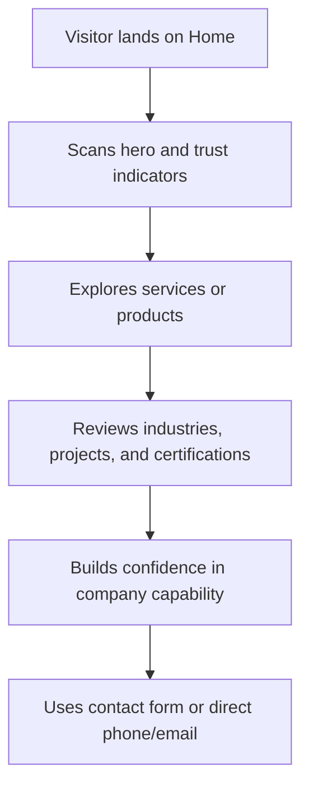

## 1. Product Overview
Build a premium, minimalist corporate website for `GSB INFRASTRUCTURE`.
- Primary goal: establish trust, explain capabilities clearly, and drive qualified inquiries for infrastructure, industrial, or engineering services.
- Company confirmation: the site will represent `GSB INFRASTRUCTURE`, based on the user's clarification and the PDF cover page.
- Market value: a strong corporate website improves credibility, supports sales conversations, and centralizes service, product, and contact information.

## 2. Core Features

### 2.1 User Roles
This is a public marketing website with no authenticated user roles in Phase 1.

### 2.2 Feature Module
1. **Home page**: hero, trust signals, company introduction, core capabilities, industries, proof sections, CTA, contact summary.
2. **About page**: company overview, mission/vision, leadership or team summary, process, values, infrastructure, certifications.
3. **Services page**: grouped service categories, detailed service cards, process steps, CTA.
4. **Products page**: featured products, specifications summary, related use cases, inquiry CTA.
5. **Industries page**: target sectors, needs by industry, solutions mapping, trust section.
6. **Projects page**: project highlights, client or sector tags, gallery, outcomes.
7. **Certifications page**: certifications, compliance, quality systems, downloadable proofs if available.
8. **Sustainability page**: environmental commitments, water or waste impact, responsible operations.
9. **Contact page**: location, contact channels, inquiry form, map placeholder, office details.

### 2.3 Page Details
| Page Name | Module Name | Feature description |
|-----------|-------------|---------------------|
| Home page | Hero | Strong positioning statement, supporting proof, two clear CTAs |
| Home page | Trust strip | Certifications, key stats, client or sector trust signals |
| Home page | Core services | Reusable service cards linking to detail sections |
| Home page | Industries served | Sector cards with concise solution mapping |
| Home page | Why choose us | Reliability, expertise, response time, quality commitment |
| Home page | Process | Simple step-based operational or treatment process timeline |
| Home page | Featured products | Product cards with summary copy and inquiry actions |
| Home page | Projects or clients | Case-study style proof section with images if available |
| Home page | Contact CTA | Friction-light inquiry prompt and contact details |
| About page | Company profile | Mission, vision, company history, differentiators |
| Services page | Service groups | Modular sections for each service family |
| Products page | Product catalog preview | Product cards, application notes, CTA |
| Industries page | Industry cards | Problems, solutions, and relevant offerings |
| Projects page | Gallery and proof | Project images, locations, categories, outcomes |
| Certifications page | Compliance proof | Logos, descriptions, audit/compliance notes |
| Contact page | Contact form | Inquiry fields, validation, alternative contact methods |

## 3. Core Process
Visitors arrive from search, referrals, or direct sales outreach. They validate credibility quickly, understand the company's capabilities, review proof such as industries, products, certifications, and projects, then contact the company for consultation or quotation.

## 4. User Interface Design
### 4.1 Design Style
- Design direction: minimalist, premium, technical, trustworthy, and spacious
- Primary colors: deep slate or navy, clean white, muted steel gray
- Accent colors: controlled aqua or teal for water/engineering emphasis, plus a restrained warm neutral for highlights
- Button style: medium-radius, solid primary and outline secondary variants
- Fonts: refined serif for display headlines and a clean sans-serif for body content
- Layout style: desktop-first, wide sections, measured asymmetry, high whitespace
- Icon style: thin-line industrial and engineering icons from `lucide-react`

### 4.2 Page Design Overview
| Page Name | Module Name | UI Elements |
|-----------|-------------|-------------|
| Home page | Hero | Large headline, concise proof copy, split CTA, premium imagery |
| Home page | Services | Clean cards, icon accents, subtle hover states |
| Home page | Process | Timeline or numbered steps with restrained motion |
| Home page | Products | Image-led cards, tags, short spec bullets |
| Home page | Proof sections | Statistics, testimonials, certifications, project snapshots |
| Contact page | Inquiry form | Clear labels, semantic form controls, accessible validation |

### 4.3 Responsiveness
- Desktop-first with mobile adaptation
- Prioritize readable typography, reduced clutter, and stacked content on smaller screens
- Keep navigation, CTAs, and contact methods accessible on touch devices

## 5. Content and Business Analysis
### 5.1 Confirmed Information
- Company name visible in the PDF cover: `GSB INFRASTRUCTURE`
- Head office address: `6/212A Pachat Veedu, Mannur PO, Kozhikode, Kerala - 673301`
- Email: `gsbinfra9@gmail.com`
- Landline: `0495 2470058`
- Mobile numbers: `9656536188`, `9847345633`

### 5.2 Current Business Interpretation
- The website will be positioned for `GSB INFRASTRUCTURE`.
- Based on currently available evidence, the safe positioning is infrastructure, industrial, or engineering services until fuller service details are provided.
- Water-treatment-specific positioning is no longer assumed.

### 5.3 Strengths We Can Present Once Confirmed
- Regional presence and physical office address
- Multiple direct contact methods
- Potential engineering/infrastructure positioning
- Opportunity to present process rigor, certifications, and projects in a premium B2B format

### 5.4 Missing Information Required Before Implementation
- Official company description and business domain
- Full list of services
- Product catalog or featured products
- Industries served
- Vision, mission, and differentiators
- Certifications, registrations, or compliance marks
- Project portfolio, clients, or testimonials
- Brand assets: logo, preferred colors, imagery, and photography
- Social media links and preferred call-to-action destination

## 6. Reference Inspiration Analysis
### 6.1 What Works in the Reference
- Clear hero with one strong promise and immediate trust proof
- Social proof placed early
- Portfolio or proof-led storytelling before deep service detail
- Consistent visual identity carried from hero to footer
- Final CTA uses calm, plain-English conversion language

### 6.2 What We Will Adapt
- Strong whitespace and high visual hierarchy
- Early trust section below hero
- Modular proof sections for certifications, projects, or sectors
- Structured but concise service presentation

### 6.3 What We Will Avoid
- Copying layout, wording, or visual identity
- Overly long scrolling with repetitive proof blocks
- Dense service checklists with weak differentiation

## 7. Recommended Page Scope
- Keep: `Home`, `About`, `Services`, `Products`, `Industries`, `Projects`, `Process`, `Certifications`, `Contact`
- Conditional: `Sustainability`, `Gallery`, `Why Choose Us`
- Remove or merge if content is thin: `Testimonials`, `Gallery`, or a separate `Why Choose Us` page

## 8. Open Questions
1. Can you provide a readable text profile with services, products, industries, certifications, and project details for `GSB INFRASTRUCTURE`?
2. Should the positioning lean more toward infrastructure contractor, industrial engineering partner, or a more specialized niche once service details are shared?
3. What should be the primary CTA: request a quote, schedule a consultation, or direct call/email inquiry?

## 9. Dummy Data Note
- To keep the project moving, Phase 2 uses provisional dummy service, product, industry, certification, and project content.
- The current IA and upcoming wireframe/component planning should be treated as structurally valid but content-flexible.
- See `information-architecture.md` for the active dummy content assumptions.
