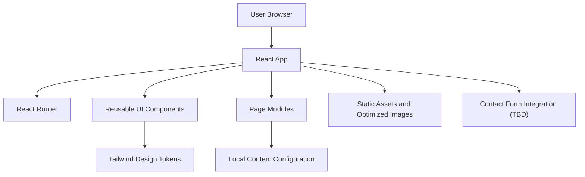
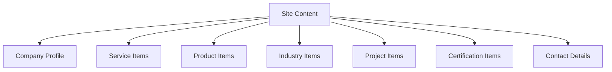

## 1. Architecture Design


## 2. Technology Description
- Frontend: `React@18` + `TypeScript` + `Vite`
- Routing: `react-router-dom`
- Styling: `tailwindcss`
- Motion: `framer-motion` for subtle entrance and interaction effects only
- Icons: `lucide-react`
- State: local state with hooks; `zustand` only if cross-page UI state becomes necessary
- Forms: native form handling first; validation library only if complexity warrants it
- Hosting: static frontend deployment, provider to be decided later

## 3. Route Definitions
| Route | Purpose |
|-------|---------|
| / | Home page with positioning, services, proof, and contact CTA |
| /about | Company overview, mission, values, and process |
| /services | Full service breakdown with grouped capabilities |
| /products | Product highlights and inquiry-oriented product browsing |
| /industries | Sector-specific needs and solution mapping |
| /projects | Project gallery or case-study style proof |
| /certifications | Quality systems, certifications, and compliance |
| /sustainability | Sustainability commitments and operational responsibility |
| /contact | Inquiry form, contact details, and location |

## 4. API Definitions
No backend is required in the initial phase unless the contact form needs server-side delivery or CRM integration.

### 4.1 Optional Contact Form Contract
```ts
export interface ContactFormPayload {
  name: string;
  company?: string;
  email: string;
  phone?: string;
  subject?: string;
  message: string;
  interest?: "services" | "products" | "projects" | "general";
}

export interface ContactFormResponse {
  success: boolean;
  message: string;
}
```

## 5. Server Architecture Diagram
Not applicable for the current static-first scope.

## 6. Data Model
No persistent database is required for the initial marketing site.

### 6.1 Content Model Definition


## 7. Frontend Structure
- `src/app`: application shell, routes, providers
- `src/components`: shared UI such as navbar, footer, buttons, cards, section wrappers
- `src/features/home`: homepage-specific composed sections
- `src/features/services`: service-related sections and cards
- `src/features/products`: product-related UI
- `src/features/contact`: form and contact detail modules
- `src/pages`: route-level page composition
- `src/data`: structured content and configuration objects
- `src/utils`: helpers for formatting, SEO config, and shared logic
- `src/types`: shared TypeScript types

## 8. Engineering Decisions
- Use a static-first architecture because the current requirements are content-led and performance-sensitive.
- Keep content structured in TypeScript objects first so the site can be launched quickly and later migrated to a CMS if needed.
- Avoid dynamic imports and unnecessary runtime complexity.
- Use subtle motion only for section reveal, card hover, and CTA emphasis.
- Treat accessibility, semantic markup, and metadata as first-class requirements.

## 9. Performance and Quality Targets
- Lighthouse target above `95`
- WCAG AA color contrast and keyboard accessibility
- Semantic HTML across all page sections
- Optimized images, lazy loading where it helps, and minimal bundle weight
- Route-level SEO metadata and structured content hierarchy

## 10. Current Blockers
- Company identity is confirmed as `GSB INFRASTRUCTURE`, but the detailed business positioning still depends on fuller service and product content.
- Service, product, certification, and project content are missing from the usable source material.
- Contact form integration destination is not yet defined.
